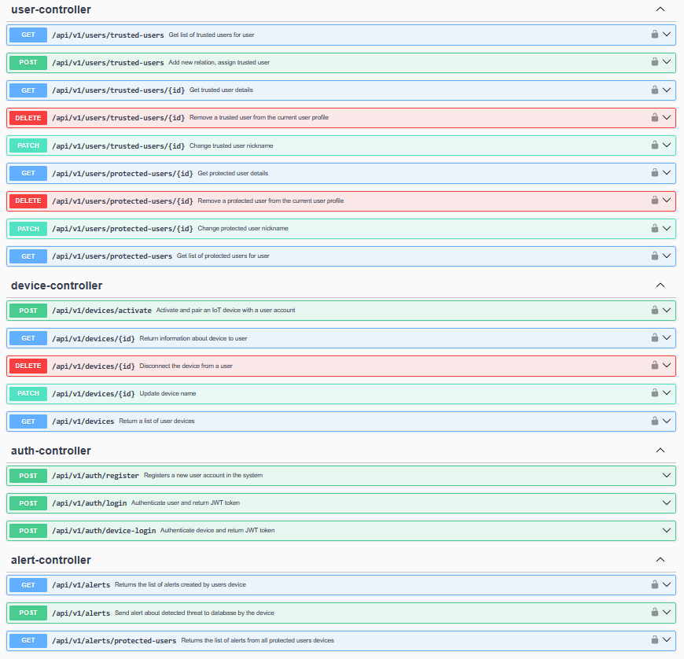

# Audio Violence Detection

  
  
  
  
  
  

> [!IMPORTANT]
> **Project in active development.** The core REST API, authentication, device provisioning and alert flow are
> implemented. Planned work includes Kafka-based event processing and IoT communication over MQTT.

## 🧩 Engineering thesis project

Domestic violence often happens behind closed doors, where traditional emergency calls are impossible. This engineering
thesis project aims to change that by providing a **discreet, automated safety net**.

Instead of relying on manual intervention, the system uses **edge-computing (TinyML)** on an **IoT device** to **detect
signs of violence in real-time**. When a critical event is classified, this **Spring Boot backend** acts as the central
hub - **securely routing alerts** to a **trusted network of guardians**, allowing them to react when it matters most.

⚠️ *Note: This system is a **proof-of-concept** for thesis purposes
and **does not replace professional emergency services**.*

---

This repository is the backend part of the four-component system. The remaining components are listed below.

| Repository                                                                               | Role                                                        |
|------------------------------------------------------------------------------------------|-------------------------------------------------------------|
| [Backend API](https://github.com/emillia-q/audio-violence-detection-backend)             | Secure API, device lifecycle, alerts and user relationships |
| [TinyML model](https://github.com/emillia-q/audio-violence-detection-tinyml)             | On-device audio violence classification                     |
| [IoT hardware](https://github.com/emillia-q/audio-violence-detection-hardware)           | Edge device that runs the model and sends alerts            |
| [React Native application](https://github.com/emillia-q/audio-violence-detection-mobile) | Mobile experience for protected and trusted users           |

## 🔄 System flow

## 📱 API preview

The API is documented with Swagger UI and includes JWT Bearer authentication support for protected endpoints.

## 🏗️ Architecture highlights

**🛡️ Security & Identity**

* **Stateless Authentication:** Registration and login secured with BCrypt and JWT-based sessions.
* **Role-Based Access Control:** Strict authorization distinguishing human users (`USER`) from IoT hardware (`DEVICE`).
  Missing/invalid credentials return `401`; an authenticated principal lacking a required role receives `403`.
* **Privacy-First API:** Unauthorized access attempts to someone else's resources return `404 Not Found` to prevent data
  enumeration attacks.

**⚙️ Core Business Logic & Domain**

* **Secure Device Onboarding:** Factory-provisioned edge devices are safely paired using MAC addresses and hashed
  secrets, ensuring no duplicate records.
* **Alert Fan-Out & DDD:** The domain cleanly separates immutable `Alerts` (device event history) from transient
  `Notifications` (actionable tasks for trusted guardians).
* **Safety Network:** Users can seamlessly establish trusted relationships, manage contact names, and monitor their
  protected wards.

**🗄️ Data & Performance**

* **Versioned Database:** Schema evolution is strictly managed by Liquibase, with Hibernate running in `validate` mode
  to prevent schema drift.
* **Optimized Read Models:** Strategic use of Spring Data projections ensures API queries return only necessary fields,
  reducing memory footprint.
* **Standardized Exception Handling:** A global `@RestControllerAdvice` layer sanitizes errors, hiding internal
  implementation details while returning consistent API responses.

## 👩‍💻 Author

Built by [Emilia Kura](https://github.com/emillia-q) as part of an engineering thesis.
